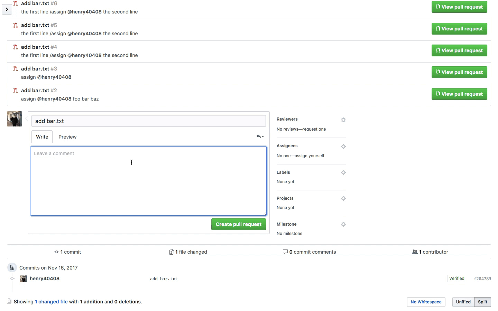

# assign-in-comment

[](https://circleci.com/gh/henry40408/assign-in-comment) [](https://codecov.io/gh/henry40408/assign-in-comment) [](https://github.com/henry40408/assign-in-comment/releases) [](https://github.com/henry40408/assign-in-comment/blob/master/LICENSE)

> directly assign members in issue or pull request description



## Setup

```bash
$ npm install # Install dependencies
$ npm start # Run the bot
```

See [docs/deploy.md](docs/deploy.md) if you would like to run your own instance of this app.

## Configuration

> currently no configuration is available

## License

MIT
